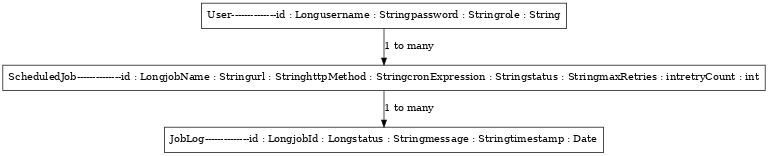

# Chronos - Job Scheduling System

Chronos is a robust, production-ready Spring Boot application for managing scheduled HTTP jobs using Quartz Scheduler. It supports job creation, modification, deletion, pausing/resuming, and logs every job execution. This documentation outlines everything you need to know to understand, set up, and use the system effectively.

---

## 🚀 Features

- REST API for job scheduling and management
- Quartz-based job execution
- Secure authentication using JWT
- PostgreSQL for job and log persistence
- Swagger UI for API exploration
- Logging of each job run (success or failure)
- Retry support for failed jobs
- Docker-ready and production-configurable

---

## 📐 Architecture


- **Client**: Swagger, Postman, or any HTTP client
- **REST API**: Spring Boot controller layer
- **Auth**: JWT-based filter for securing endpoints
- **Services**: Business logic for job and log handling
- **Quartz Scheduler**: Executes HTTP jobs on cron
- **Database**: PostgreSQL stores jobs and logs

---

## 🧩 Entity Relationship (ER) Diagram



---

## 🛠️ Design Decisions

- **Quartz Scheduler**: Chosen for reliability and cron support
- **JWT**: Lightweight, stateless authentication
- **PostgreSQL**: Ideal for relational job and log storage
- **Spring Boot**: Rapid development and production-readiness
- **Separation of Concerns**: Controllers → Services → Quartz → DB

---

## 🧪 Testing

- Uses JUnit 5 + Mockito for service/controller tests
- `@SpringBootTest` used for integration testing
- Test coverage includes:
  - Job creation, update, delete, resume/pause
  - Scheduler rescheduling and deletion
  - Error handling and validation

---

## 📂 API Endpoints

### 🧑‍💼 User Controller

| Method | Endpoint             | Description                |
|--------|----------------------|----------------------------|
| POST   | `/auth/register`     | Register new user          |
| POST   | `/auth/login`        | Login and return JWT token |

### 🕒 Job Controller

| Method | Endpoint             | Description                      |
|--------|----------------------|----------------------------------|
| GET    | `/jobs`              | Get all scheduled jobs           |
| GET    | `/jobs/{id}`         | Get job by ID                    |
| POST   | `/jobs`              | Create new job                   |
| PUT    | `/jobs/{id}`         | Update existing job              |
| DELETE | `/jobs/{id}`         | Delete job                       |
| POST   | `/jobs/{name}/pause` | Pause job by name                |
| POST   | `/jobs/{name}/resume`| Resume paused job by name        |

---

## 🔐 Security

- JWT secured endpoints
- `/auth/**` is publicly accessible
- All `/jobs/**` require a valid JWT token

---

# Clone the repository
git clone https://github.com/yourname/chronos.git
cd chronos

# Configure database in application.properties

# Build the project
./mvnw clean install

# Run the app
./mvnw spring-boot:run

# Visit Swagger UI
http://localhost:8080/swagger-ui.html


## 🧾 SQL Model

```sql
CREATE TABLE users (
  id SERIAL PRIMARY KEY,
  username VARCHAR(255) UNIQUE NOT NULL,
  password VARCHAR(255) NOT NULL,
  role VARCHAR(50) NOT NULL
);

CREATE TABLE scheduled_job (
  id SERIAL PRIMARY KEY,
  job_name VARCHAR(255) UNIQUE NOT NULL,
  url TEXT NOT NULL,
  http_method VARCHAR(10) NOT NULL,
  cron_expression VARCHAR(255) NOT NULL,
  status VARCHAR(50),
  max_retries INT,
  retry_count INT
);

CREATE TABLE job_log (
  id SERIAL PRIMARY KEY,
  job_id INT REFERENCES scheduled_job(id),
  status VARCHAR(50),
  message TEXT,
  timestamp TIMESTAMP DEFAULT CURRENT_TIMESTAMP
);
-- Quartz PostgreSQL schema
CREATE TABLE QRTZ_JOB_DETAILS (
  SCHED_NAME VARCHAR(120) NOT NULL,
  JOB_NAME VARCHAR(200) NOT NULL,
  JOB_GROUP VARCHAR(200) NOT NULL,
  DESCRIPTION VARCHAR(250),
  JOB_CLASS_NAME VARCHAR(250) NOT NULL,
  IS_DURABLE BOOLEAN NOT NULL,
  IS_NONCONCURRENT BOOLEAN NOT NULL,
  IS_UPDATE_DATA BOOLEAN NOT NULL,
  REQUESTS_RECOVERY BOOLEAN NOT NULL,
  JOB_DATA BYTEA,
  PRIMARY KEY (SCHED_NAME, JOB_NAME, JOB_GROUP)
);

CREATE TABLE QRTZ_TRIGGERS (
  SCHED_NAME VARCHAR(120) NOT NULL,
  TRIGGER_NAME VARCHAR(200) NOT NULL,
  TRIGGER_GROUP VARCHAR(200) NOT NULL,
  JOB_NAME VARCHAR(200) NOT NULL,
  JOB_GROUP VARCHAR(200) NOT NULL,
  DESCRIPTION VARCHAR(250),
  NEXT_FIRE_TIME BIGINT,
  PREV_FIRE_TIME BIGINT,
  PRIORITY INTEGER,
  TRIGGER_STATE VARCHAR(16) NOT NULL,
  TRIGGER_TYPE VARCHAR(8) NOT NULL,
  START_TIME BIGINT NOT NULL,
  END_TIME BIGINT,
  CALENDAR_NAME VARCHAR(200),
  MISFIRE_INSTR SMALLINT,
  JOB_DATA BYTEA,
  PRIMARY KEY (SCHED_NAME, TRIGGER_NAME, TRIGGER_GROUP),
  FOREIGN KEY (SCHED_NAME, JOB_NAME, JOB_GROUP)
    REFERENCES QRTZ_JOB_DETAILS(SCHED_NAME, JOB_NAME, JOB_GROUP)
);

CREATE TABLE QRTZ_SIMPLE_TRIGGERS (
  SCHED_NAME VARCHAR(120) NOT NULL,
  TRIGGER_NAME VARCHAR(200) NOT NULL,
  TRIGGER_GROUP VARCHAR(200) NOT NULL,
  REPEAT_COUNT BIGINT NOT NULL,
  REPEAT_INTERVAL BIGINT NOT NULL,
  TIMES_TRIGGERED BIGINT NOT NULL,
  PRIMARY KEY (SCHED_NAME, TRIGGER_NAME, TRIGGER_GROUP),
  FOREIGN KEY (SCHED_NAME, TRIGGER_NAME, TRIGGER_GROUP)
    REFERENCES QRTZ_TRIGGERS(SCHED_NAME, TRIGGER_NAME, TRIGGER_GROUP)
);

CREATE TABLE QRTZ_CRON_TRIGGERS (
  SCHED_NAME VARCHAR(120) NOT NULL,
  TRIGGER_NAME VARCHAR(200) NOT NULL,
  TRIGGER_GROUP VARCHAR(200) NOT NULL,
  CRON_EXPRESSION VARCHAR(120) NOT NULL,
  TIME_ZONE_ID VARCHAR(80),
  PRIMARY KEY (SCHED_NAME, TRIGGER_NAME, TRIGGER_GROUP),
  FOREIGN KEY (SCHED_NAME, TRIGGER_NAME, TRIGGER_GROUP)
    REFERENCES QRTZ_TRIGGERS(SCHED_NAME, TRIGGER_NAME, TRIGGER_GROUP)
);

CREATE TABLE QRTZ_BLOB_TRIGGERS (
  SCHED_NAME VARCHAR(120) NOT NULL,
  TRIGGER_NAME VARCHAR(200) NOT NULL,
  TRIGGER_GROUP VARCHAR(200) NOT NULL,
  BLOB_DATA BYTEA,
  PRIMARY KEY (SCHED_NAME, TRIGGER_NAME, TRIGGER_GROUP),
  FOREIGN KEY (SCHED_NAME, TRIGGER_NAME, TRIGGER_GROUP)
    REFERENCES QRTZ_TRIGGERS(SCHED_NAME, TRIGGER_NAME, TRIGGER_GROUP)
);

CREATE TABLE QRTZ_CALENDARS (
  SCHED_NAME VARCHAR(120) NOT NULL,
  CALENDAR_NAME VARCHAR(200) NOT NULL,
  CALENDAR BYTEA NOT NULL,
  PRIMARY KEY (SCHED_NAME, CALENDAR_NAME)
);

CREATE TABLE QRTZ_PAUSED_TRIGGER_GRPS (
  SCHED_NAME VARCHAR(120) NOT NULL,
  TRIGGER_GROUP VARCHAR(200) NOT NULL,
  PRIMARY KEY (SCHED_NAME, TRIGGER_GROUP)
);

CREATE TABLE QRTZ_FIRED_TRIGGERS (
  SCHED_NAME VARCHAR(120) NOT NULL,
  ENTRY_ID VARCHAR(95) NOT NULL,
  TRIGGER_NAME VARCHAR(200) NOT NULL,
  TRIGGER_GROUP VARCHAR(200) NOT NULL,
  INSTANCE_NAME VARCHAR(200) NOT NULL,
  FIRED_TIME BIGINT NOT NULL,
  SCHED_TIME BIGINT NOT NULL,
  PRIORITY INTEGER NOT NULL,
  STATE VARCHAR(16) NOT NULL,
  JOB_NAME VARCHAR(200),
  JOB_GROUP VARCHAR(200),
  IS_NONCONCURRENT BOOLEAN,
  REQUESTS_RECOVERY BOOLEAN,
  PRIMARY KEY (SCHED_NAME, ENTRY_ID)
);

CREATE TABLE QRTZ_SCHEDULER_STATE (
  SCHED_NAME VARCHAR(120) NOT NULL,
  INSTANCE_NAME VARCHAR(200) NOT NULL,
  LAST_CHECKIN_TIME BIGINT NOT NULL,
  CHECKIN_INTERVAL BIGINT NOT NULL,
  PRIMARY KEY (SCHED_NAME, INSTANCE_NAME)
);

CREATE TABLE QRTZ_LOCKS (
  SCHED_NAME VARCHAR(120) NOT NULL,
  LOCK_NAME VARCHAR(40) NOT NULL,
  PRIMARY KEY (SCHED_NAME, LOCK_NAME)
);

